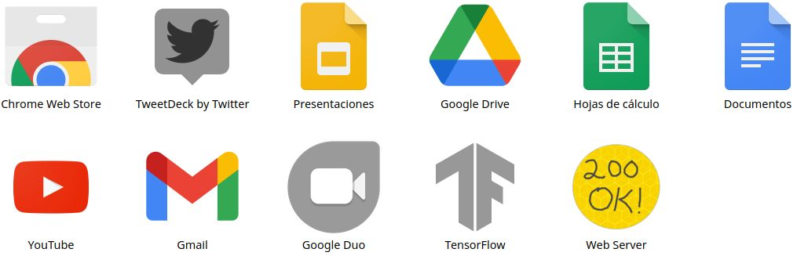
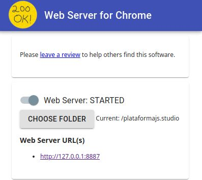

# Plataforma JS

Este proyecto intenta llevar el entrenamiento y visualización de Redes Neuronales a un simple navegador web. Para esto, implementa TensorFlow.js a través de varios modelos desarrollados e implementados en esta pagina web, convertiendola en una plataforma de visualización o frontend base para futuros proyectos en Aprendizaje Automático.

### Forma básica de uso
**Esto iniciará un servidor local que permite la ejecución completa de la plataforma y sus proyectos implementados**
- Clonar este repositorio
  - `git clone git@github.com:ccofres/plataformaJS.git`

- Abrir Google Chrome
- Ingresar a las Chrome Apps: [chrome://apps/](chrome://apps/)

- Iniciar "Web Server", y seleccionar la carpeta del proyecto.

